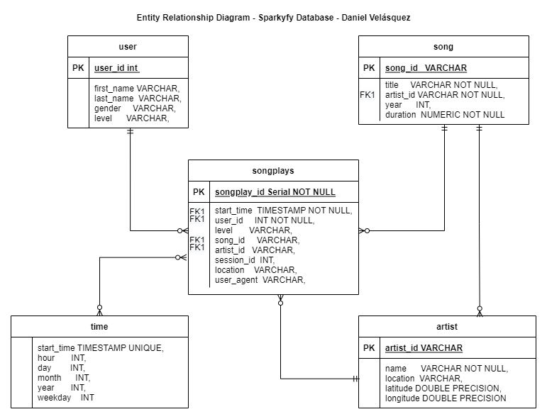

# Responding business question:
## the purpose of this database in the context of the startup, Sparkify, and their analytical goals.
> The purpose of this database is to gather information about ***user activity on their new music streaming app***, their _analytics teams_ wants to know **what songs are the user listening to**, they can create many machine learning models like suggestion models, lists with the most listened by them among others.
## How to run the Python scripts
> You can run the python scripts through the **terminal**, you firstly need to run ***create_tables.py***, here you will create the database and the tables that will storaged the streaming app information, after this you need to run ***etl.py***, this script is the ETL in charge of take the .json's files and formatting for putting into the tables on SQL postgres.
>  - **Command line**: ```>>> python create_tables.py && python etl.py```
>  - **&&** means that afther ***create_tables.py*** executes correctly ***etl.py*** will start its execution.    
## Explanation of the files in the repository
There are two data sets that contains **JSON format files**,one of them is ***song dataset** that is partitioned by the first three letters of each song's track ID with this dataset the 'song' and 'artis' tables are created, then there is ***log dataset*** that are partitioned by year and month, with this dataset the 'songplay', 'user' and 'time' tables are created.

Below you can see the entity relationship diagram: 
> 
## State and justify your database schema design and ETL pipeline.
The database has a **start schema**, we have a fact table called 'songplays', and ***'user'***,***'song'***,***'artist'*** and ***'date'*** tables are dimension table.
- Fact table:
  - **songplay**:
    - _songplay_id_ Serial PRIMARY KEY
    - _start_time_ timestamp NOT NULL
    - _user_id_ int NOT NULL
    - _level_ varchar
    - _song_id_ varchar
    - _session_id_ int
    - _location_ varchar
    - _user_agent_ varchar
- Dimension tables:
  - **user**:
    - _user_id_ int PRIMARY KEY
    - _first_name_ varchar
    - _last_name_ varchar
    - _gender_ varchar
    - _level_ varchar
  - **song**:
    - _song_id_ int PRIMARY KEY
    - _title_ varchar NOT NULL
    - _artist_id_ varchar NOT NULL
    - _year_ int
    - _duration_ numeric NOT NULL
  - **artist**:
    - _artist_id_ varchar PRIMARY KEY
    - name varchar NOT NULL
    - _location_ varchar
    - _latitude_ doble precision
    - _longitude_ doble precision
  - **time**:
    - _start_time_ timestamp UNIQUE
    - _hour_ int
    - _day_ int
    - _month_ int
    - _year_ int
    - _weekday_ int

**ETL**

 extract(files.json) -> transform(organice the data for each table) -> load(we push the cleaned and organized data into SQL postgres)
